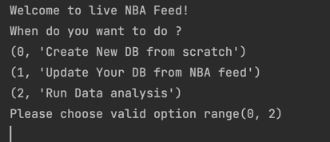

# NBA Data Project
    This project is aimed at creating a SQL database from official NBA data, updating the database with new information, and running analysis on the data.

## Requirements
    To run this project, you need to have the following software installed on your machine:

    * Python 3.8
    * SQLite
    * Pandas
    * PySpark on pandas


## Project Features
    ** The project consists of the following three main features:

    ** Creating a SQL database: The script will extract data from the official NBA website and create a SQL database using SQLite.

    ** Updating the database: The script will check for updates to the data on the official NBA website and update the database accordingly.

    ** Running database analysis: The script will use Pandas to analyze the data in the database and generate various statistics and visualizations.


## Running the Project
To run the project, open your terminal and navigate to the directory where the project is located. Then, run the following command:

```bash
./nba_feed_project.py
```

    1. Select one of following optsions:


The program is continue running till you stop.
So you can update the DB as long as you want..
