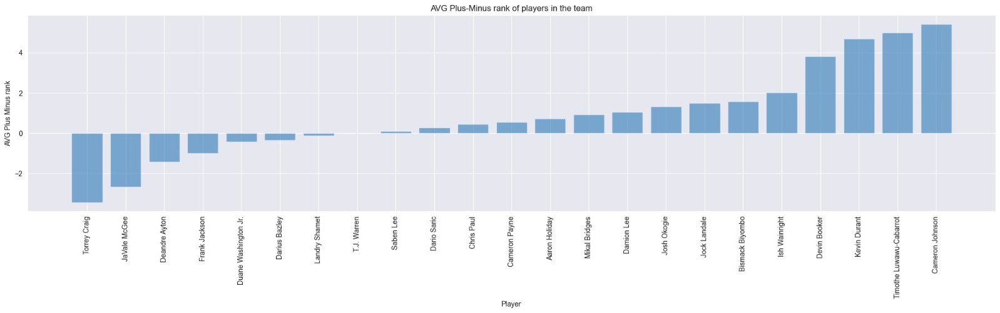

# NBA Data Project
    This project is aimed at creating a SQL database from official NBA data, updating the database with new information, and running analysis on the data.
    This is a LIVE POD, can run forever and update the data when asked to.

## Requirements
    To run this project, you need to have the following software installed on your machine:

    * Python >= 3.9
    * SQLite
    * PySpark on pandas
    * papermill
    * matplotlib
    * numpy


## Project Features
    ** The project consists of the following three main features:

    *** Creating a SQL database: Extract data from the official NBA website and create a SQL database using SQLite.

    *** Updating the database: Check for updates to the data on the official NBA website and update the database accordingly.

    *** Running database analysis: Using Pandas on Pyspark on  analyze the data in the database and generate various statistics, visualizations and predictions.


## Running the Project
To run the project, open your terminal and navigate to the directory where the project is located. Then, run the following command:

```bash
./nba_feed_project.py
```

    1. Select one of following optsions:


1) **first option** - will create a new empty DB, called **"NBA_DATA_BIG_DATA_PROJECT.db"**, delete if exists.
2) **second option** - fetch the data from official NBA feed, insert/update new entries in the DB.
3) **Third option** - run the analysis on the DB called "NBA_DATA_BIG_DATA_PROJECT.db" in a jupyter notebook "results_Big_data_Final_project_analysis.ipynb"
4) **Terminate program**

**_Analysis results example:**_



NBA DB ER:


high level design:

